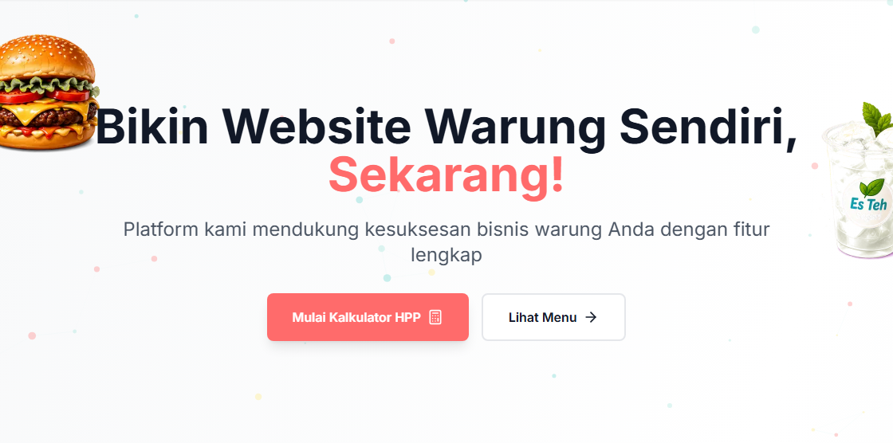
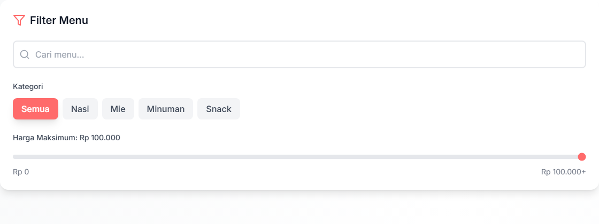
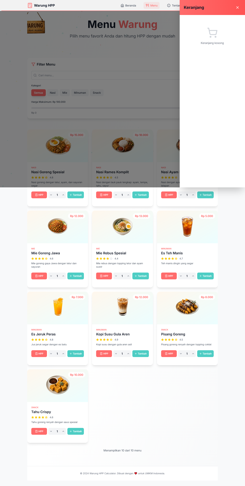
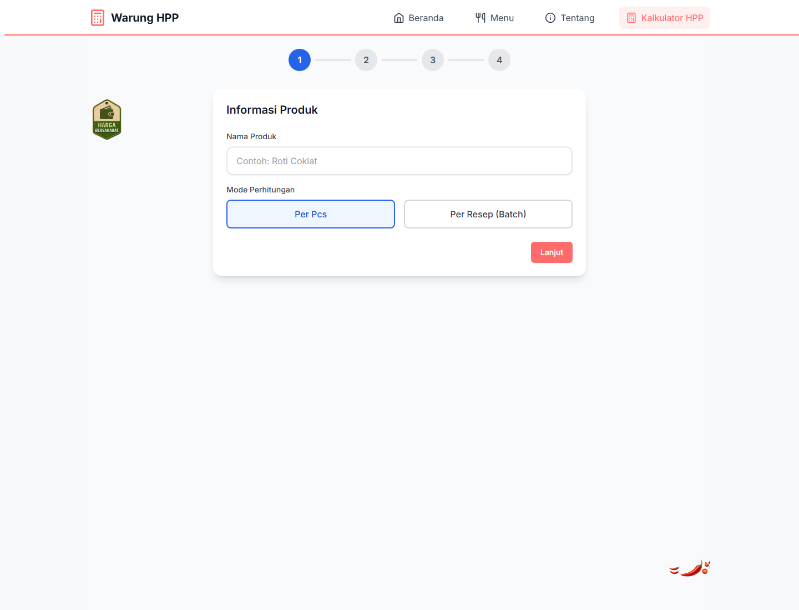
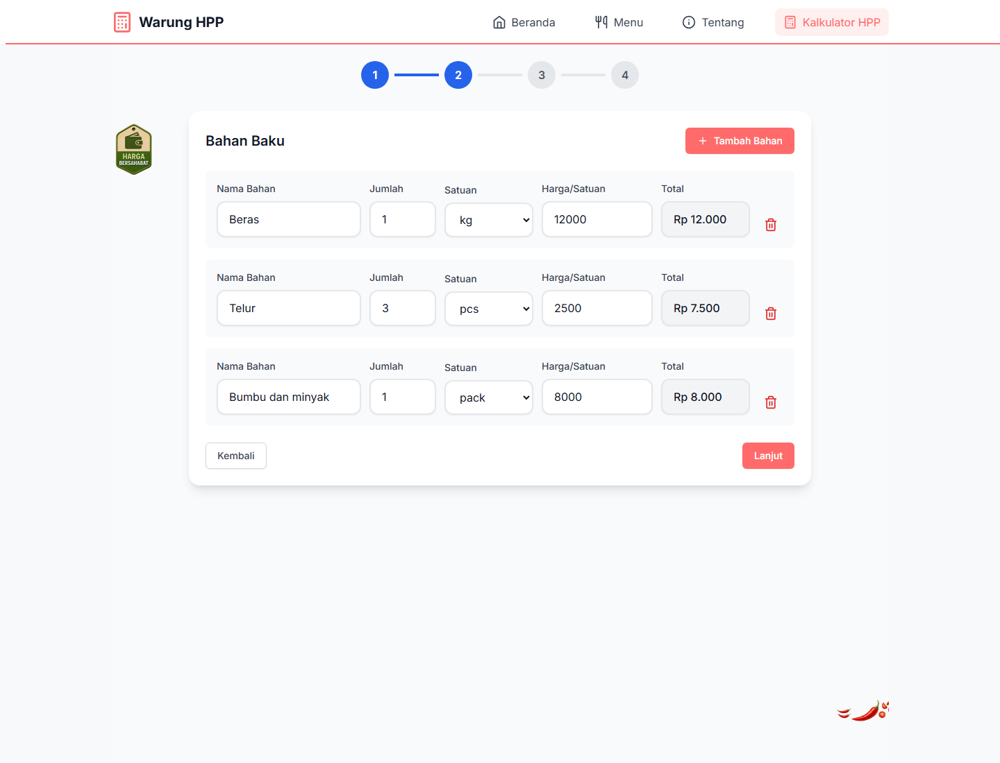
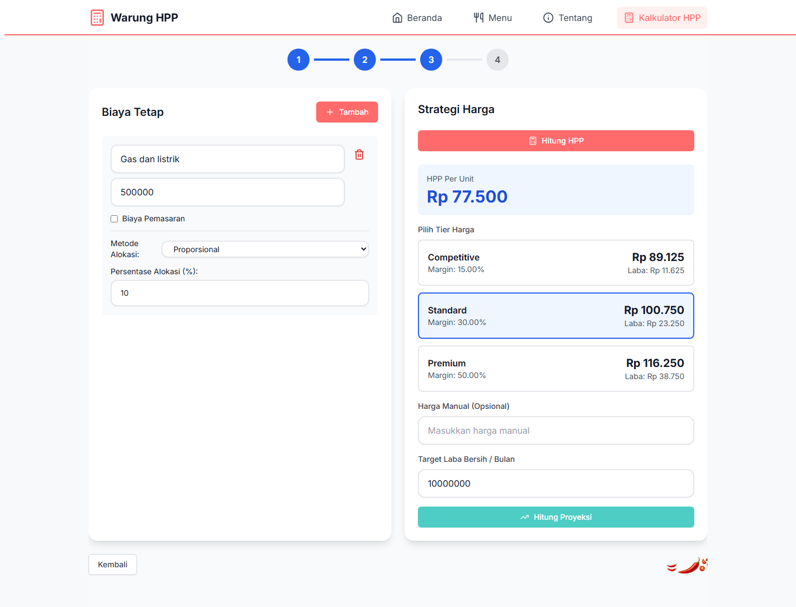
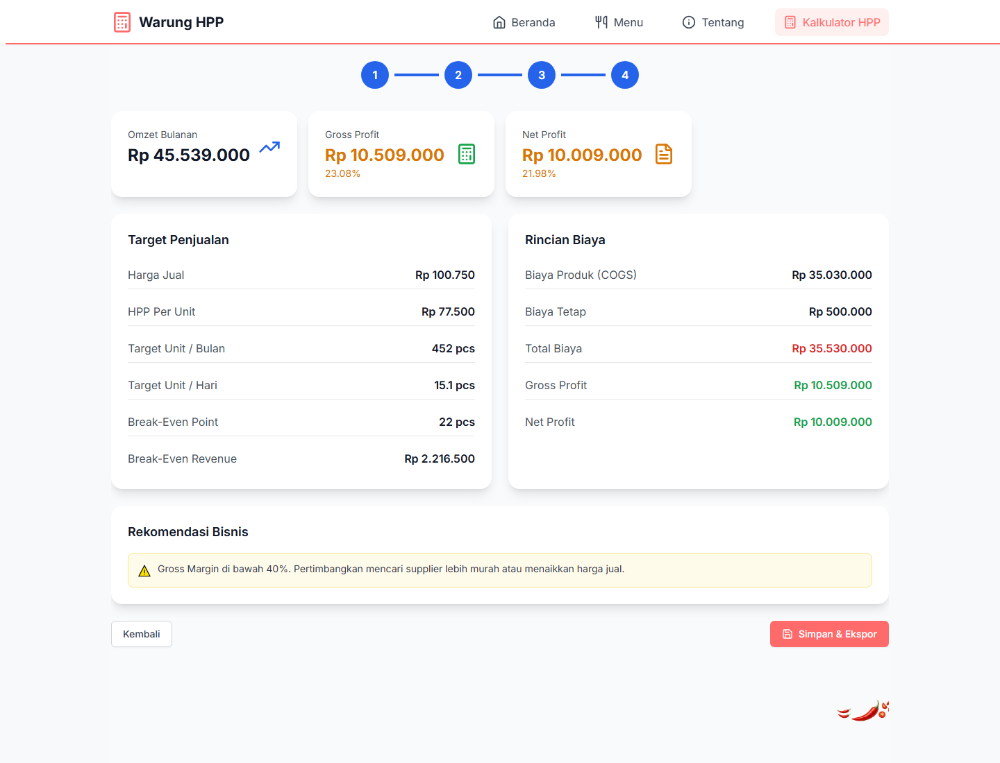

# Warung HPP

Warung HPP adalah aplikasi web untuk membantu pemilik warung dan UMKM mengelola menu, menghitung HPP, menentukan harga jual, dan melihat proyeksi bisnis. Aplikasi ini dibangun dengan Next.js untuk frontend dan FastAPI untuk backend.

## Daftar Section Keseluruhan

### Beranda

1. Hero
2. Fitur Unggulan
3. Paket Harga
4. CTA Pengembangan Bisnis
5. Chatbot Asisten Virtual
6. Footer

### Menu

1. Hero Menu
2. Filter Menu
3. Grid Menu
4. Keranjang

### Tentang

1. Hero Tentang
2. Sejarah dan Statistik
3. Tim Kami
4. Testimoni Pemilik Warung
5. Artikel Terkini
6. Footer

### Kalkulator HPP

1. Informasi Produk
2. Bahan Baku
3. Biaya Tetap dan Strategi Harga
4. Hasil Proyeksi Bisnis

## Screenshot dan Penjelasan Per Section

### 1. Beranda - Hero



Section pembuka menampilkan pesan utama "Bikin Website Warung Sendiri, Sekarang!" dengan dua aksi utama: masuk ke Kalkulator HPP atau melihat halaman Menu. Bagian ini menjadi pintu masuk utama pengguna.

### 2. Beranda - Fitur Unggulan


Section ini memperkenalkan fitur inti platform: Kasir & POS, QR Code Payment, WhatsApp Order, dan Kalkulator HPP. Setiap fitur ditampilkan dalam kartu agar mudah dipindai.

### 3. Beranda - Paket Harga


Section paket harga membandingkan pilihan Dasar, Standar, dan Bisnis. Paket Standar diberi penanda "Paling Populer" untuk menonjolkan rekomendasi utama.

### 4. Beranda - CTA Pengembangan Bisnis


Section CTA mengajak pemilik warung mulai memakai platform untuk mengembangkan bisnis. Tombol utama diarahkan ke halaman Kalkulator HPP.

### 5. Beranda - Chatbot Asisten Virtual


Section chatbot menyediakan area percakapan untuk bertanya tentang rekomendasi menu atau informasi layanan. Tujuannya membantu pengguna mendapatkan jawaban cepat tanpa berpindah halaman.

### 6. Beranda - Footer


Footer menutup halaman dengan identitas aplikasi dan keterangan bahwa aplikasi dibuat untuk mendukung UMKM Indonesia.

### 7. Menu - Hero


Hero halaman Menu menjelaskan bahwa pengguna dapat memilih menu favorit dan menghitung HPP dari menu tersebut. Bagian ini memberi konteks sebelum pengguna masuk ke daftar produk.

### 8. Menu - Filter Menu



Filter Menu menyediakan pencarian, pilihan kategori, dan batas harga maksimum. Fitur ini membantu pengguna menemukan menu berdasarkan kebutuhan dengan cepat.

### 9. Menu - Grid Menu


Grid Menu menampilkan kartu makanan dan minuman berisi gambar, kategori, rating, deskripsi, harga, tombol HPP, pilihan jumlah, dan tombol tambah ke keranjang.

### 10. Menu - Keranjang



Keranjang muncul sebagai panel samping. Pengguna dapat melihat item pesanan, mengubah jumlah, menghapus item, melihat total harga, dan melanjutkan ke checkout.

### 11. Tentang - Hero


Hero halaman Tentang memperkenalkan Warung Digital sebagai platform yang membantu warung tradisional bertransformasi digital sejak 2020.

### 12. Tentang - Sejarah dan Statistik


Section ini menjelaskan latar belakang platform dan menampilkan metrik penting seperti jumlah warung terbantu, kepuasan pelanggan, rata-rata kenaikan omzet, dan dukungan pelanggan.

### 13. Tentang - Tim Kami


Section Tim Kami memperlihatkan profil anggota tim, peran, dan ringkasan pengalaman mereka. Bagian ini membangun kepercayaan terhadap orang di balik platform.

### 14. Tentang - Testimoni Pemilik Warung


Section testimoni menampilkan cerita pemilik warung yang merasakan dampak positif dari penggunaan platform, seperti peningkatan omzet dan kemudahan operasional.

### 15. Tentang - Artikel Terkini


Section artikel berisi konten edukasi seputar HPP, digital marketing, dan manajemen stok. Bagian ini memperkuat posisi aplikasi sebagai pendamping bisnis, bukan hanya alat hitung.

### 16. Tentang - Footer


Footer pada halaman Tentang menjaga konsistensi identitas aplikasi dan menutup halaman dengan pesan dukungan untuk UMKM.

### 17. Kalkulator HPP - Informasi Produk



Step pertama meminta nama produk dan mode perhitungan, yaitu per pcs atau per resep/batch. Ini menjadi dasar cara aplikasi menghitung biaya per unit.

### 18. Kalkulator HPP - Bahan Baku



Step Bahan Baku dipakai untuk memasukkan komponen produksi seperti nama bahan, jumlah, satuan, harga per satuan, dan total biaya. Data ini menjadi komponen utama perhitungan HPP.

### 19. Kalkulator HPP - Biaya Tetap dan Strategi Harga



Step ketiga menggabungkan biaya tetap, metode alokasi, hasil HPP per unit, dan pilihan tier harga. Pengguna dapat memilih harga kompetitif, standar, premium, atau mengisi harga manual.

### 20. Kalkulator HPP - Hasil Proyeksi Bisnis



Step hasil menampilkan KPI bisnis seperti omzet bulanan, gross profit, net profit, target penjualan, break-even point, rincian biaya, dan rekomendasi bisnis berdasarkan margin.

## Teknologi

- Frontend: Next.js 14, React, TypeScript, TailwindCSS
- Backend: FastAPI, SQLAlchemy
- Database: MySQL
- UI: Lucide React, Framer Motion, Recharts

## Menjalankan Project

### Frontend

```bash
cd frontend
npm install
npm run dev
```

Frontend berjalan di `http://localhost:3000`.

### Backend

```bash
cd backend
pip install -r requirements.txt
uvicorn main:app --reload --host 0.0.0.0 --port 8000
```

Backend berjalan di `http://localhost:8000`.

## Struktur Project

```text
warung/
├── frontend/        # Aplikasi Next.js
├── backend/         # API FastAPI
├── database/        # File database dan aset pendukung
├── docs/            # Dokumentasi dan screenshot
└── README.md        # Dokumentasi utama GitHub
```
